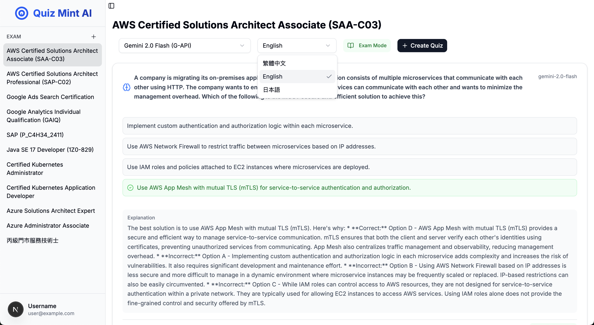

# Quiz Mint AI

## Screenshots



## Getting Started

### Prerequisites

- Node.js (Latest LTS version recommended)
- Docker (Optional, for Docker-based setup)

### Installation

1. Clone repo
```bash
git clone https://github.com/oz841119/quiz-mint-ai.git
cd quiz-mint-ai
```

2. Install dependencies
```bash
npm install
# or
yarn install
```

3. Configure environment variables
```bash
cp env.demo .env.local
```
Then modify the configurations in `.env.local` as needed.

### Development

You can run the development server in two ways:

#### Option 1: Using Docker (Recommended)

```bash
# Start development server
docker compose up

# Stop development server
docker compose down
```

#### Option 2: Manual Setup

```bash
# Start development server
npm run dev
# or
yarn dev
```

The application will be available at http://localhost:3000.

## Adding New Models

There are two main ways to add new AI models to Quiz Mint AI:

### 1. Using OpenAI-Compatible APIs

If you want to use models from APIs that are compatible with OpenAI's format (such as Google Gemini API):

1. Add your model to `src/configs/models.ts`:
```typescript
export const MODELS = [
  // ... existing models
  {
    value: "your-model-name",
    label: "Your Model Display Name",
  },
]
```

2. Update your `.env.local` file with:
```
OPEN_AI_BASE_URL=your_api_endpoint_url
MODEL_KEY=your_api_key
```

> **Note:** If you're using the official OpenAI API, you may not need to specify a custom `OPEN_AI_BASE_URL`. However, you will need to modify the `src/app/api/generate-quiz/route.ts` file to use the default OpenAI endpoint or handle specific model providers differently.

### 2. Custom Provider Implementation

For APIs that use a different format, you can create a custom provider and inject it into the AIService:

1. Implement the `AIServiceProvider` interface
2. Update the API route in `src/app/api/generate-quiz/route.ts` to use your custom provider
3. Add your models to the `MODELS` array in `src/configs/models.ts`
